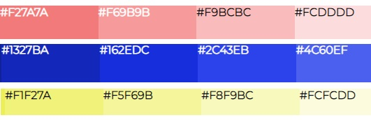

# Colour Palette Generator - API Powered
This project utilizes a dynamic color palette generation mechanism, integrating user input and an external API to create visually appealing and accessible color schemes.

Check out the [Live Site](https://silviasaverino.github.io/Colour-Palette-Generator--API-Powered-/)

## API used:
The project uses an external API: [The color api](https://www.thecolorapi.com/docs#schemes) to obtain color schemes based on user input.

The API request is made using the fetch function, and the response is processed in JSON format.

## CSS
The layout is responsive and adjusts for different screen sizes. Media queries ensure optimal display on both small and large screens.

## JS & User Interaction
The generation process begins with user interaction through the following components:

- Color Wheel: Users can 
select a base color using a color wheel interface.

- Color Scheme Selector: 
Users can choose a color scheme type from a dropdown menu.

- Get Color Scheme Button: 
Clicking this button triggers the color scheme generation based on the selected color and scheme.

The final color palette is rendered dynamically in the HTML document. Each color is displayed as a div with a background color corresponding to the API-retrieved color, and the text color is adjusted based on brightness.

## Color Manipulation with chroma-js library
In this project, color data retrieved from the API is manipulated using the chroma-js library to ascertain the text color for each hue in the generated palette. The library calculates the brightness of each color, dynamically assigning a contrasting text color ('black' or 'white') accordingly. The Chroma-js library plays a crucial role in enhancing the user experience by adjusting text color brightness in the rendered divs, ensuring optimal visibility and accessibility for each color in the palette.

### About chroma-js Library
chroma-js is a small JavaScript library for working with colors. It provides a wide range of functionalities for color manipulation, conversion, and analysis. Whether you need to generate color scales, manipulate color values, or analyze color data, chroma-js offers a simple and powerful API to handle various color-related tasks.

### Key Features:
- Color Manipulation: 
Easily manipulate and modify color values, such as changing brightness, saturation, or hue.

- Color Conversion: 
Convert colors between different formats, including RGB, HEX, HSL, LAB, and more.

- Color Scale Generation: 
Create color scales, gradients, and interpolations for smooth transitions between colors.

- Color Analysis: 
Analyze color properties, such as luminance and contrast, for accessibility and design considerations.